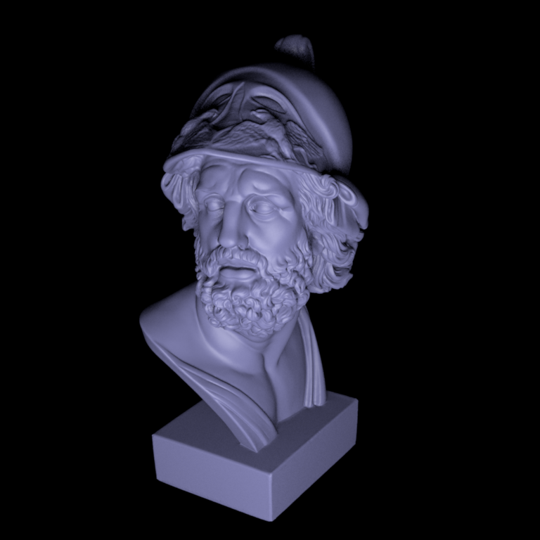
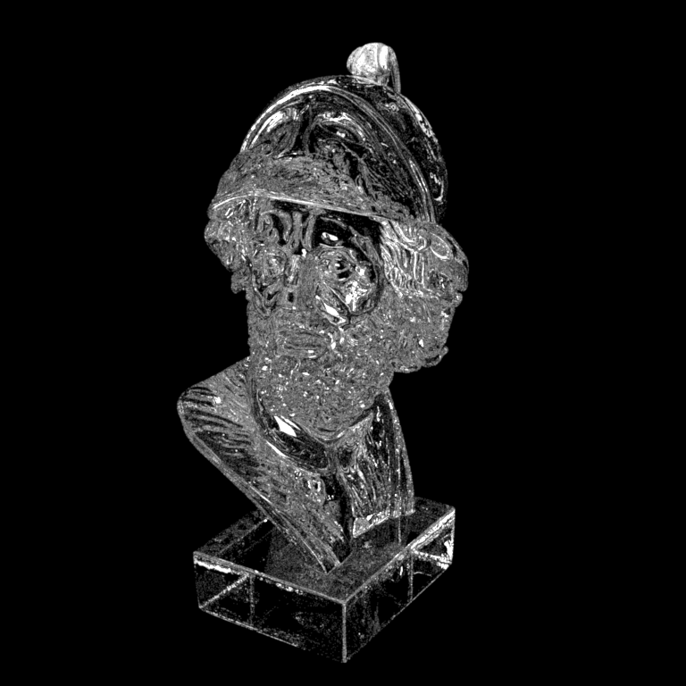
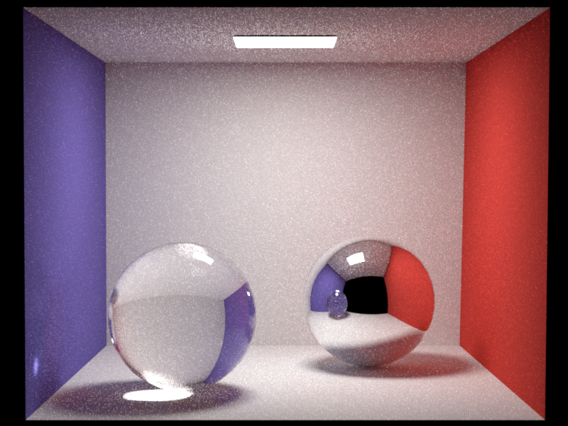
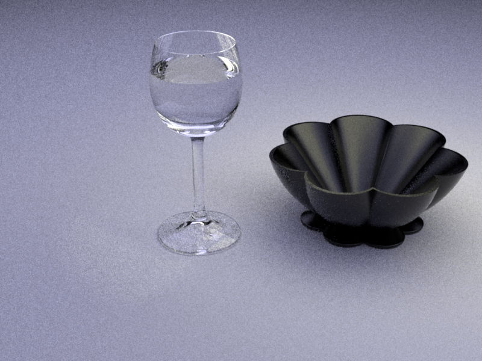
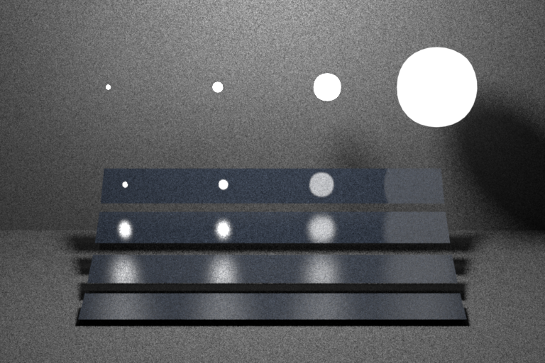

# About Nori
> Nori is a minimalistic ray tracer written in C++. It runs on Windows, Linux, and Mac OS and provides a foundation for the homework assignments in the course Advanced Computer Graphics taught at EPFL.
- Nori website is [here](https://wjakob.github.io/nori/)
- The course website is [here](http://rgl.epfl.ch/courses/ACG20)
- The original repository is [here](https://github.com/cs440-epfl/nori-base-2021)

# My work
**I wrote this renderer based on Nori for learning purposes, Here's what I did:**

- Bounding volume hierarchy(BVH) to accelerate triangle intersection

- Monte Carlo Sampling
  - Tent sampling
  - Uniform disk sampling
  - Uniform sphere sampling
  - Uniform hemisphere sampling
  - Cosine weighted hemisphere sampling
  - Beckmann sampling
  - Area light sampling

- BSDFs
  - Mirror(perferct reflection)
  - Dielectric(perfect reflection and refraction)
  - Microfacet BRDF
  
- Integrators
  - Whitted-style ray tracing
  - Material sampling path tracing
  - Emitter sampling path tracing
  - Multiple importance sampling path tracing
  
- Russian Roulette to accelerate convergence

# Reference
- [pbrt-v3 source code](https://github.com/mmp/pbrt-v3)
- [Importance Sampling](https://pbr-book.org/3ed-2018/Monte_Carlo_Integration/Importance_Sampling)
- [Bounding Volume Hierarchies](https://pbr-book.org/3ed-2018/Primitives_and_Intersection_Acceleration/Bounding_Volume_Hierarchies)
- [Microfacet Models](https://pbr-book.org/3ed-2018/Reflection_Models/Microfacet_Models)
- [Area Lights](https://pbr-book.org/3ed-2018/Light_Sources/Area_Lights)
- [Sampling](https://pbr-book.org/3ed-2018/Monte_Carlo_Integration/2D_Sampling_with_Multidimensional_Transformations)

# Gallary

